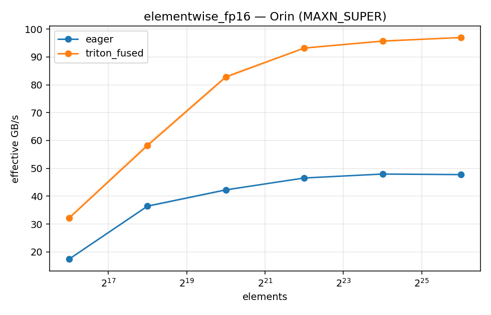
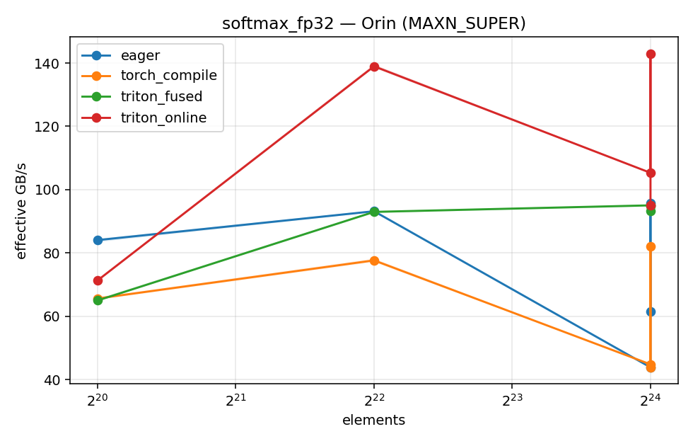
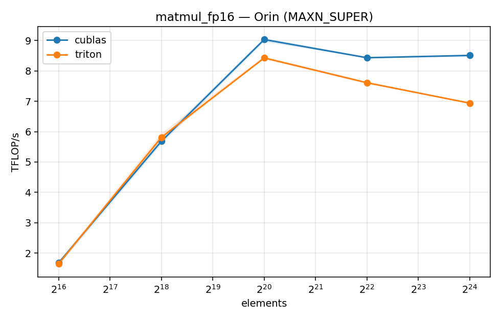

# triton-kernel-lab

Hand-written Triton GPU kernels with honest benchmarks, alongside a study track through the
compiler stack underneath them: LLVM → MLIR → Triton's lowering pipeline → TorchDynamo/Inductor.

Benchmarks run on hardware I own — an NVIDIA Jetson Orin Nano Super (Ampere, sm_87,
102 GB/s memory bandwidth) — with locked clocks and full environment metadata committed next
to every number. The interesting constraint of an 8 GB edge board is that it makes memory-traffic
accounting the whole game, which is the right instinct to train anyway.

## Kernels

| Kernel | What it exercises | Metric |
|---|---|---|
| `kernels/elementwise.py` — fused mul-add-relu | masking, coalescing, bandwidth accounting | GB/s vs ~102 GB/s device peak |
| `kernels/softmax.py` — fused row softmax + online variant | reductions, numerical stability (max-subtract), warp tuning, the online-softmax recurrence Flash-Attention builds on | GB/s vs eager `torch.softmax` |
| `kernels/matmul.py` — tiled matmul | block tiling, fp32 accumulators, `@triton.autotune`, grouped ordering for L2 reuse | TFLOP/s and **% of cuBLAS** |
| `cuda/elementwise.cu` — raw CUDA C++ baseline | the same fused elementwise written by hand (scalar + `float4` variants) — what Triton's codegen is measured against | GB/s vs the Triton version |

The framing throughout is deliberately honest. Fused elementwise beats eager because eager
launches three kernels, not because the arithmetic is clever — a lone Triton `add` merely
matches eager. And nobody hand-beats cuBLAS at matmul; the credible number is the percentage
of it you reach and an explanation of the gap.

## Methodology

- **Correctness before every timing.** `torch.testing.assert_close` against an fp32 reference
  with dtype-scaled tolerances, inside the bench loop itself — a number for a wrong kernel
  cannot be produced.
- **`triton.testing.do_bench`**: warmup, median + interquartile range, fp16 and fp32 sweeps.
- **Reproducibility on owned silicon**: MAXN power mode, `jetson_clocks` locked, cooldown
  pauses between sweep points, and torch/triton/CUDA versions + power mode recorded in every
  CSV row (`bench/results/<device>/`, committed). One command reproduces any table.
- The Jetson also runs resident services; `scripts/bench_guss.sh` pauses them, drops page
  caches, locks clocks, runs the sweep, and restores everything on exit — with every action
  logged to a committed session log.

## Running

```bash
# Correctness tests, no GPU needed (Triton CPU interpreter; CI runs exactly this)
TRITON_INTERPRET=1 pytest -q      # or: make test

# On a CUDA box: same suite against the real compiler
TRITON_INTERPRET=0 pytest -q      # or: make test-gpu

# New device? Validate it first
python scripts/jetson_smoke.py    # or: make smoke

# Full sweep (Jetson, wrapped in the pause/restore session script)
make bench
python -m bench.run --kernel softmax --dtype fp16 --sizes 4096x1024   # targeted
```

Interpreter-mode tests are a correctness gate only — sequential numpy execution, no
performance signal, no bf16.

## Results — Jetson Orin Nano (sm_87, MAXN_SUPER, locked clocks)

Every number traces to a committed CSV in [`bench/results/orin/`](bench/results/orin/) carrying
torch 2.11.0 / Triton 3.7.1 / CUDA 12.6 and the power mode in every row; PNGs are rendered from
those same CSVs by `bench/plot.py`. Device peak is ~102 GB/s.

### Elementwise: fused mul-add-relu vs eager (3 kernels)

| numel | dtype | fused | eager | speedup | fused % of peak |
|---|---|---|---|---|---|
| 2²⁰ | fp16 | 82.8 GB/s | 42.3 GB/s | 1.96× | 81% |
| 2²⁶ | fp16 | 97.0 GB/s | 47.8 GB/s | 2.03× | **95%** |
| 2²⁶ | fp32 | 97.0 GB/s | 48.3 GB/s | 2.01× | **95%** |

The 2× is not cleverness — it's arithmetic. Eager's three kernels make 8 global-memory trips
per element; the fused kernel makes 4. The traffic ratio predicts the speedup, and the speedup
arrives on schedule. Below ~2²⁰ elements both are launch-bound and the gap narrows.



### Softmax: fused single-block and online variants vs `torch.softmax` (median ms)

| shape | fp16 fused | fp16 online | fp16 eager | fp32 fused | fp32 online | fp32 eager |
|---|---|---|---|---|---|---|
| 4096×256 | 0.111 | 0.165 | **0.073** | 0.128 | 0.176 | **0.100** |
| 4096×1024 | **0.202** | 0.207 | 0.215 | 0.363 | 0.363 | 0.361 |
| 4096×4096 | **0.731** | 0.737 | 2.859 | **1.407** | 1.912 | 3.044 |
| 16384×1024 | **0.778** | 0.790 | 0.789 | 1.411 | 1.407 | 1.413 |
| 1024×16384 | **0.734** | 1.077 | 1.478 | **1.439** | 2.116 | 2.195 |

Honest reading, both directions:

- **Narrow rows (256 cols): eager wins.** One program per 256-wide row leaves the GPU
  under-occupied; `torch.softmax` batches better there. My kernels earn their keep from
  ~1K cols up.
- **Wide rows are the win**: 3.9× over eager at 4096×4096 fp16, where torch's fp16 path
  collapses to ~23 GB/s while the fused kernel holds ~92 GB/s (90% of peak).
- **The online variant matches the single-block kernel** until the row stops fitting in
  cache — its second read pass is nearly free at 4096 cols (L2 hit), and costs real time at
  16384 (fp32: 2.12 ms vs 1.44). Its GB/s column in the CSVs counts 3 passes of actual
  traffic, so it can exceed the fused kernel's number at equal time — read ms for "which is
  faster," GB/s for "how busy is the memory system."



### Tiled matmul vs cuBLAS (`torch.matmul`)

TF32 is enabled for the fp32 cuBLAS baseline because my kernel's `tl.dot` uses TF32 on
Ampere — like for like. Correctness is gated per size by measuring **both** implementations
against an fp64 reference and requiring my worst-case error within 3× cuBLAS's own (a fixed
tolerance against an IEEE reference is the wrong gate under TF32 — it rejected a correct
kernel once; see the [bring-up log](notes/bringup-log.md)).

| size | fp16 triton | fp16 cuBLAS | % | fp32 triton | fp32 cuBLAS | % |
|---|---|---|---|---|---|---|
| 256³ | 1.65 TF/s | 1.68 TF/s | 98.0% | 1.28 TF/s | 1.19 TF/s | **107.2%** |
| 512³ | 5.81 | 5.68 | **102.2%** | 3.59 | 3.63 | 98.8% |
| 1024³ | 8.43 | 9.04 | 93.3% | 4.53 | 4.54 | 99.7% |
| 2048³ | 7.61 | 8.44 | 90.2% | 3.98 | 4.28 | 93.1% |
| 4096³ | 6.94 | 8.51 | 81.5% | 3.65 | 4.92 | 74.3% |

Honest reading: parity (or slightly better, from lower launch/heuristic overhead — that's
what the >100% points are, not superior codegen) through 1024³, then a widening gap as the
working set swamps the Orin's small L2 — cuBLAS's deeper tiling arsenal (split-K, wider
config space than my six autotune candidates) earns its keep exactly where blocking gets
hard. Closing some of that 4096³ gap is the standing exercise; claiming to beat cuBLAS in
general would be an anti-signal, and these tables show why.



### Triton vs hand-written CUDA C++ (fused elementwise, fp32 GB/s)

[`cuda/elementwise.cu`](cuda/elementwise.cu) is the same fused mul-add-relu written by hand,
scalar and `float4` variants, self-checking and cudaEvent-timed.

| numel | Triton | CUDA scalar | CUDA float4 |
|---|---|---|---|
| 2²⁰ | 89.1 | 89.3 | 93.1 |
| 2²² | 95.1 | 94.3 | 96.8 |
| 2²⁶ | **97.0** | 85.9 | **97.7** |

Two lessons in one table. At bandwidth-bound sizes Triton's generated code sits within ~0.7%
of the hand-vectorized kernel — the 128-bit loads it derived from its block layout (receipts
in [module D](notes/d-lowering/README.md)) are the same ones written manually in the
`float4` variant. And the scalar variant collapsing at 2²⁶ (−12%) shows vectorized access
*is* the whole game at this op's arithmetic intensity. Small-size comparisons across the two
harnesses aren't apples-to-apples (do_bench measures through the Python wrapper; the C++
harness times raw kernels with cudaEvents), so the table starts where kernel time dominates.

## Study track (`notes/`)

Public notes with one artifact each — see [`notes/README.md`](notes/README.md):

- **A. GPU execution model** — SIMT, memory hierarchy, occupancy
- **B. Triton's programming model** — blocked programs vs CUDA threads
- **C. LLVM foundations** — SSA, IR structure, pass pipelines
- **D. Triton's lowering pipeline** — my softmax annotated through TTIR → TTGIR → LLVM IR → PTX
- **E. TorchDynamo/Inductor** — bytecode capture, guards, graph breaks; what `torch.compile`
  does to my softmax, and how its generated Triton compares to mine

## Roadmap

- [x] **M0** — scaffold, elementwise + softmax kernels, interpreter-verified tests, bench harness, CI
- [x] **M1** — Jetson bring-up, first committed GPU numbers,
  [softmax lowering artifact](notes/d-lowering/README.md) (notes D seed)
- [x] **M2** — tiled matmul + autotune (% of cuBLAS), raw CUDA C++ elementwise baseline,
  [reading Inductor's generated Triton](notes/e-inductor/README.md) for softmax,
  [bring-up log](notes/bringup-log.md) of every failure and fix
- [x] **M3** — study notes A–D complete ([A](notes/a-gpu-execution/README.md) ·
  [B](notes/b-triton-model/README.md) · [C](notes/c-llvm/README.md) ·
  [D](notes/d-lowering/README.md))
- [ ] **M4** — Dynamo/Inductor module, `torch.compile` steady-state baseline, perf plots

## Toolchain notes

torch and triton are deliberately unpinned in `pyproject.toml`: each platform installs its own
build (Jetson: NVIDIA's JetPack wheel index; CI: CPU wheels) and the versions that produced any
benchmark are recorded with it. CI runs lint (ruff), typecheck (pyright), and the interpreter-mode
suite on every push.

Jetson bring-up gotchas (JetPack 6 / L4T r36, learned the hard way): pin torch **by index, not
just version** — a bare resolve happily grabs PyPI's SBSA cu13 aarch64 wheel, which the Jetson
driver can't load (`--index-url https://pypi.jetson-ai-lab.io/jp6/cu126 --no-deps torch==2.11.0`,
then deps from PyPI). And that wheel links `libcudss`, which JetPack doesn't ship —
`pip install nvidia-cudss-cu12`, then `source scripts/jetson_env.sh` puts the pip-installed
NVIDIA libs on `LD_LIBRARY_PATH` (the bench session script sources it automatically).
